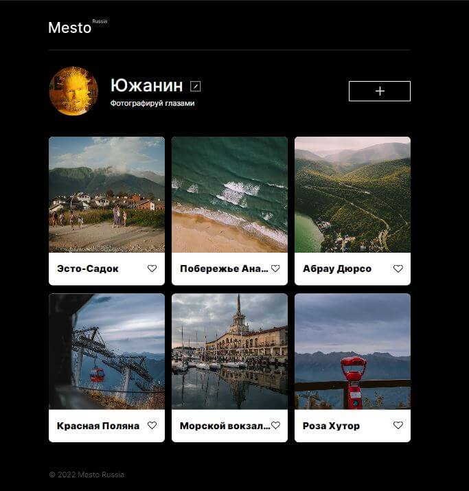

# Проект: Место React

## [Демонстрация сайта](https://marusillda.github.io/react-mesto-auth/)

## ***Содержание:***
- [Описание проекта](#Description)
- [Используемые технологии](#Technologies)
- [Оценка качества кода](#Quality)
- [Планы по доработке проекта](#Planes)
- [Инструкция по запуску проекта](#Instruction)

# Описание проекта 

**Место** — самостоятельный интерактивный проект в рамках обучения на курсе "Web-разработчик" в Яндекс Практикум с использованием React. В рамках обучения для выполнения проектной работы был предоставлен макет в программе [Figma](https://www.figma.com/file/2cn9N9jSkmxD84oJik7xL7/JavaScript.-Sprint-4?node-id=0%3A1) и макет регистрации и авторизации [Figma](https://www.figma.com/file/5H3gsn5lIGPwzBPby9jAOo/Sprint-14-RU?node-id=0%3A1.), по которым нужно было сверствать сайт.
Проект "Место" должен корректно отображаться на экранах размеров 1280px и 320px.

# Используемые технологии 

1. Проект реализован с помощью framework React и утилиты Create React App (CRA).
2. Использованы функциоанльные и классовые компоненты, хуки.
3. Элементы пользовательнского интерефейса описаны с помощью JSX — это расширение синтаксиса JavaScript.
4. За описание внешнего вида сайта отвечает язык каскадных таблиц стилей CSS.
5. Все элементы страницы и стили реализованы в соответствии с концепцией [БЭМ](https://ru.bem.info/methodology/quick-start/).
6. При размещении элементов на странице использовалась технология для создания сложных гибких макетов [CSS Flexbox](https://doka.guide/css/flexbox-guide/) и технология [CSS Grid Layout](https://doka.guide/css/flexbox-guide/), которая предлагает систему компоновки на основе сетки со строками и столбцами.
7. Все кнопки на странице имеют состояние наведении мыши. Этот эффект реализован с использованием [псевдоклассов](https://doka.guide/css/pseudoclasses/) и свойства [CSS Transition](https://doka.guide/css/transition/).
8. Изменение внешнего вида элемнтов для корректного отображения на устройствах разного типа реализовано с помощью директив CSS - [медиазапросов](https://doka.guide/css/media/).
9. Плавное открытие и закрытие попапов реализовано с помощью свойств СSS visibility, opacity и transition.
10. Проект поключен к серверу. С сервера загружаются:
  - Информация о пользователе
  - Карточки
  - Количество лайков
11. Создан объект контекста и использован провайдер для передачи данных пользователя во все компоненты.
12. Реализована поддержка лайков и дизлайков.
13. Реализовано удаление карточки, добавленной полььзователем, и добаление карточки с новым местом.
14. Добавлена возможность редактировать данные ползователя.
15. Для получения значений инпутов использован как рефы, так и управляемые копоненты.
16. Написана регистрация и авторизация в проект Mesto на «Реакте».
17. Добавлены всплывающие окна ссообщением успешной регистрации и с сообщением об ошибке при регистрации и авторизации.
18. Настроена работа с localStorage.
18. Дополнительно реализована валидация всех необходимых форм и попапов с помощью создания пользовательского хука по валидации, который можно переиспользовать для  различных форм путем добвления новых правил валидации.

# Оценка качества кода 
Качество кода обусловлено его проверкой по чек-листу Яндекс Практикума, автоматическими проверками и код-ревью специалистом Яндекс Практикума.

# Планы по доработке проекта 
- добавить попап подтверждения удаления карточки с местом.
- реализовать гамбургер-меню в шапке сайта для отображения имени пользователя и кнопки Выйти на разрешении 320px.

# Инструкция по запуску проекта 
- Клонируем репозиторий себе на ПК;
- В терминале поочередно вписываем команды: npm install --> npm run build --> npm run dev
